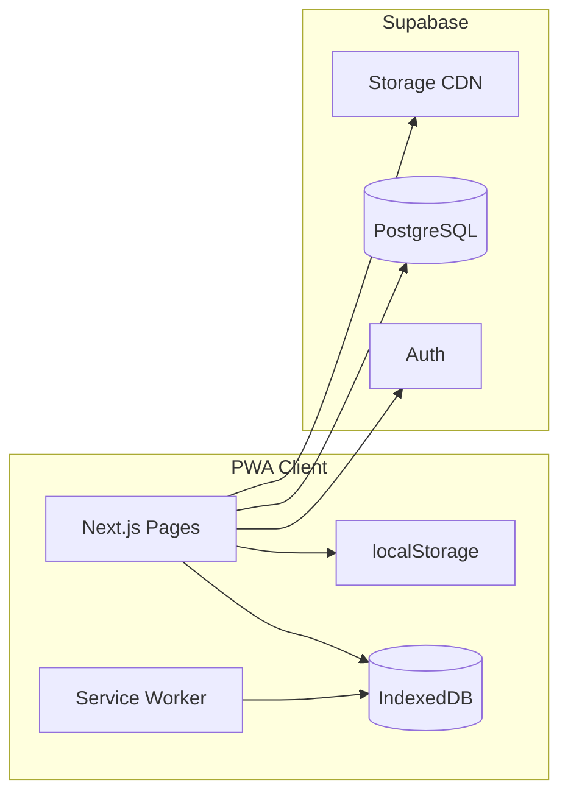
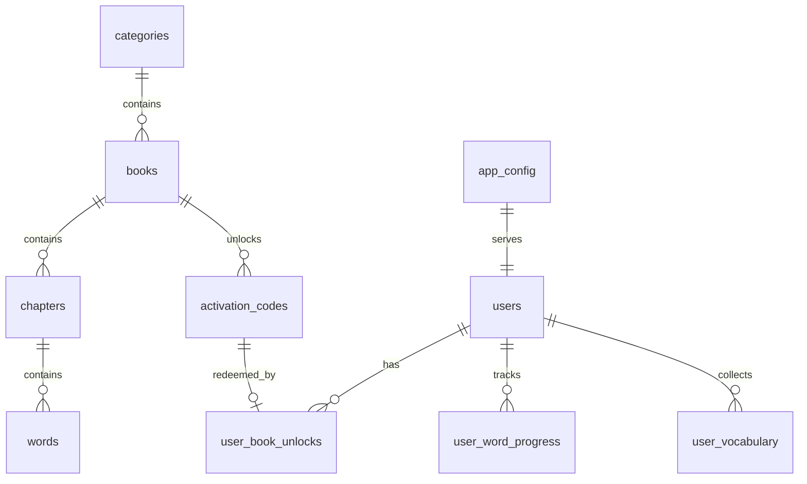

# 📁 缅甸语专业背单词 App - 历史技术规范与实现指南

> **文档性质**：项目早期技术设计，用于追溯实现意图，不是当前产品 PRD。
>
> **当前入口**：[产品 PRD](product.md) | [前端 UI 设计](ui-design.md) | [当前技术架构](../docs/project/architecture.md)
>
> **事实规则**：内容与当前代码或数据库迁移冲突时，以当前实现为准。

---

## 1. 技术栈选型 (Tech Stack)

| 层级 | 选型 | 说明 |
|------|------|------|
| 框架 | **Next.js 14+ (App Router)** | SSR/SSG 首页与词书目录；背词页 Client Component |
| 样式 | **Tailwind CSS** | 对齐 UI.md Design Tokens |
| 组件 | **Shadcn UI** | Dialog、Sheet、Button、Input、Progress |
| 动效 | **Framer Motion** | 卡片翻转、页面过渡、进度条动画 |
| 后端 | **Supabase** | Auth、PostgreSQL、Row Level Security、Storage（音频/图） |
| 本地持久化 | **IndexedDB (Dexie.js)** | 章节缓存、背词进度、生词本、媒体 Blob 索引 |
| 轻量 KV | **localStorage** | 登录 token 缓存、审核模式标记、上次路由 |
| PWA | **@serwist/next** 或 **next-pwa** | Service Worker、离线 Shell、章节 JSON 预缓存 |
| 烟花 | **canvas-confetti** | 章节通关特效 |
| 缅文 | **Pyidaungsu** + CSS `@font-face` | 见 §5 |

**不采用**：Flutter / React Native（统一 Web/PWA 一套代码，降低维护成本）。

---

## 2. 系统架构总览



**数据流原则**

1. **词书元数据 + 章节词条**：首次进入章节时拉取 JSON → 写入 IndexedDB → 背词全程读本地。
2. **学习进度 / 生词本 / 激活状态**：先写 IndexedDB（即时）→ 后台队列异步 `upsert` 到 Supabase（联网时）。
3. **媒体（音频/图片）**：按需 fetch → Blob 存 IndexedDB；「清理缓存」只删 Blob 表，不动进度表。

---

## 3. Supabase 数据库 Schema

### 3.1 ER 关系简图



### 3.2 表定义（PostgreSQL）

```sql
-- ─────────────────────────────────────────
-- 应用全局配置（找回密码、审核模式、Banner）
-- ─────────────────────────────────────────
CREATE TABLE app_config (
  id            SMALLINT PRIMARY KEY DEFAULT 1 CHECK (id = 1),
  is_review_mode BOOLEAN NOT NULL DEFAULT false,
  forgot_password_contact TEXT,          -- 展示文案，如「微信：xxx」
  forgot_password_qr_url  TEXT,          -- 找回密码二维码图 URL
  author_wechat_qr_url    TEXT,          -- 激活码弹窗内作者二维码
  updated_at    TIMESTAMPTZ NOT NULL DEFAULT now()
);

-- ─────────────────────────────────────────
-- 用户（微信 ID 即 username，Supabase Auth 扩展）
-- ─────────────────────────────────────────
CREATE TABLE profiles (
  id              UUID PRIMARY KEY REFERENCES auth.users(id) ON DELETE CASCADE,
  wechat_id       TEXT NOT NULL UNIQUE,  -- 注册时填写的微信号，作登录账号
  display_name    TEXT,
  avatar_url      TEXT,
  streak_days     INT NOT NULL DEFAULT 0,
  last_study_date DATE,
  created_at      TIMESTAMPTZ NOT NULL DEFAULT now()
);

-- ─────────────────────────────────────────
-- Level 1 分类
-- ─────────────────────────────────────────
CREATE TABLE categories (
  id          TEXT PRIMARY KEY,          -- e.g. cat_textbook
  title       TEXT NOT NULL,
  sort_order  INT NOT NULL DEFAULT 0,
  is_visible  BOOLEAN NOT NULL DEFAULT true
);

-- ─────────────────────────────────────────
-- Level 2 词书（含苹果进度条所需聚合字段）
-- ─────────────────────────────────────────
CREATE TABLE books (
  id            TEXT PRIMARY KEY,
  category_id   TEXT NOT NULL REFERENCES categories(id),
  title         TEXT NOT NULL,
  description   TEXT,
  cover_url     TEXT,
  is_premium    BOOLEAN NOT NULL DEFAULT false,
  is_free       BOOLEAN NOT NULL DEFAULT false,  -- 免费词书跳过激活
  sort_order    INT NOT NULL DEFAULT 0,
  word_count    INT NOT NULL DEFAULT 0,          -- 全书词数，后台维护或触发器汇总
  chapter_count INT NOT NULL DEFAULT 0,
  created_at    TIMESTAMPTZ NOT NULL DEFAULT now()
);

-- ─────────────────────────────────────────
-- Level 3 章节
-- ─────────────────────────────────────────
CREATE TABLE chapters (
  id          TEXT PRIMARY KEY,
  book_id     TEXT NOT NULL REFERENCES books(id) ON DELETE CASCADE,
  title       TEXT NOT NULL,
  sort_order  INT NOT NULL DEFAULT 0,
  word_count  INT NOT NULL DEFAULT 0           -- 用于 UI「12/50」分母
);

-- ─────────────────────────────────────────
-- 单词（内容主表；大字段可走 Storage，此处存 URL）
-- ─────────────────────────────────────────
CREATE TABLE words (
  id                    TEXT PRIMARY KEY,
  chapter_id            TEXT NOT NULL REFERENCES chapters(id) ON DELETE CASCADE,
  sort_order            INT NOT NULL DEFAULT 0,
  word_mm               TEXT NOT NULL,
  word_en               TEXT,                  -- 可选英文对照
  word_zh               TEXT NOT NULL,
  phonetic              TEXT,
  notes                 TEXT,
  example_sentence_mm   TEXT,
  example_sentence_zh   TEXT,
  audio_url             TEXT,
  image_url             TEXT
);

-- ─────────────────────────────────────────
-- 激活码（Level 2 词书解锁）
-- ─────────────────────────────────────────
CREATE TABLE activation_codes (
  code            TEXT PRIMARY KEY,            -- 6-12 位，建议大写字母+数字
  book_id         TEXT NOT NULL REFERENCES books(id),
  max_uses        INT NOT NULL DEFAULT 1,      -- 1=一码一人；可设 N 用于渠道批码
  used_count      INT NOT NULL DEFAULT 0,
  expires_at      TIMESTAMPTZ,
  is_active       BOOLEAN NOT NULL DEFAULT true,
  created_at      TIMESTAMPTZ NOT NULL DEFAULT now()
);

-- ─────────────────────────────────────────
-- 用户已解锁词书（多端 Restore 依据）
-- ─────────────────────────────────────────
CREATE TABLE user_book_unlocks (
  user_id       UUID NOT NULL REFERENCES profiles(id) ON DELETE CASCADE,
  book_id       TEXT NOT NULL REFERENCES books(id),
  unlocked_via  TEXT NOT NULL DEFAULT 'activation_code', -- activation_code | free | admin
  code_used     TEXT REFERENCES activation_codes(code),
  unlocked_at   TIMESTAMPTZ NOT NULL DEFAULT now(),
  PRIMARY KEY (user_id, book_id)
);

-- ─────────────────────────────────────────
-- 章节级学习进度（已掌握词数 → 驱动 12/50 与苹果进度条）
-- ─────────────────────────────────────────
CREATE TABLE user_chapter_progress (
  user_id           UUID NOT NULL REFERENCES profiles(id) ON DELETE CASCADE,
  chapter_id        TEXT NOT NULL REFERENCES chapters(id) ON DELETE CASCADE,
  mastered_count    INT NOT NULL DEFAULT 0,    -- 分子
  last_word_index   INT NOT NULL DEFAULT 0,    -- 断点续背
  last_studied_at   TIMESTAMPTZ,
  completed_at      TIMESTAMPTZ,             -- 通关时间，用于打卡统计
  PRIMARY KEY (user_id, chapter_id)
);

-- ─────────────────────────────────────────
-- 单词级熟练度（闪卡「认识/不认识」沉淀）
-- ─────────────────────────────────────────
CREATE TABLE user_word_progress (
  user_id       UUID NOT NULL REFERENCES profiles(id) ON DELETE CASCADE,
  word_id       TEXT NOT NULL REFERENCES words(id) ON DELETE CASCADE,
  status        TEXT NOT NULL DEFAULT 'new', -- new | learning | mastered
  familiar      BOOLEAN,                     -- 最近一次是否点「认识」
  updated_at    TIMESTAMPTZ NOT NULL DEFAULT now(),
  PRIMARY KEY (user_id, word_id)
);

-- ─────────────────────────────────────────
-- 生词本
-- ─────────────────────────────────────────
CREATE TABLE user_vocabulary (
  user_id     UUID NOT NULL REFERENCES profiles(id) ON DELETE CASCADE,
  word_id     TEXT NOT NULL REFERENCES words(id) ON DELETE CASCADE,
  starred_at  TIMESTAMPTZ NOT NULL DEFAULT now(),
  PRIMARY KEY (user_id, word_id)
);

-- ─────────────────────────────────────────
-- 首页 Banner
-- ─────────────────────────────────────────
CREATE TABLE banners (
  id          TEXT PRIMARY KEY,
  image_url   TEXT NOT NULL,
  link_url    TEXT,                            -- 非审核模式 WebView 打开
  sort_order  INT NOT NULL DEFAULT 0,
  is_active   BOOLEAN NOT NULL DEFAULT true
);
```

### 3.3 苹果细进度条：服务端计算 vs 客户端聚合

**推荐：客户端聚合（减少写放大）**

```typescript
// 词书进度 = 该书所有章节的 mastered_count 之和 / books.word_count
function bookProgress(
  chapters: { word_count: number }[],
  progress: Record<string, { mastered_count: number }>
): number {
  const mastered = chapters.reduce(
    (sum, ch) => sum + (progress[ch.id]?.mastered_count ?? 0),
    0
  );
  const total = chapters.reduce((sum, ch) => sum + ch.word_count, 0);
  return total === 0 ? 0 : mastered / total;
}
```

可选：在 `books` 上增加 **物化视图或定时任务** 写 `cached_mastered_ratio`，仅当词书词量极大且首页列表卡顿再启用。

### 3.4 Row Level Security（RLS）要点

```sql
-- profiles：用户只能读写自己的行
ALTER TABLE profiles ENABLE ROW LEVEL SECURITY;
CREATE POLICY profiles_self ON profiles
  FOR ALL USING (auth.uid() = id);

-- user_* 表：同上，user_id = auth.uid()
-- words / chapters / books / categories / banners：authenticated 只读
-- activation_codes：禁止客户端直读；仅通过 Edge Function 核销
```

### 3.5 激活码核销（Edge Function 伪逻辑）

```
POST /functions/v1/redeem-activation
Body: { code: string }
1. SELECT * FROM activation_codes WHERE code = UPPER(trim(code)) AND is_active
2. 校验 expires_at、used_count < max_uses
3. INSERT user_book_unlocks (user_id, book_id, code_used)
4. UPDATE activation_codes SET used_count = used_count + 1
5. 返回 { book_id, title }
```

### 3.6 Auth 与「微信号登录」映射

| PRD 要求 | Web 实现 |
|----------|----------|
| 账号 = 微信号 | 注册：`email = {wechat_id}@app.internal`（或 Supabase 自定义 metadata） |
| 密码登录 | `supabase.auth.signInWithPassword` |
| 找回密码人工 | **不调用** `resetPasswordForEmail`；登录页读 `app_config.forgot_password_*` 展示 |

---

## 4. API 与 Next.js 路由规划

### 4.1 App Router 目录结构

```
app/
├── (auth)/
│   ├── login/page.tsx
│   └── register/page.tsx
├── (main)/
│   ├── layout.tsx              # Bottom Tab 64dp
│   ├── page.tsx                # 首页：Banner + 分类词书
│   ├── books/[bookId]/page.tsx # Level 3 章节列表
│   ├── study/[chapterId]/page.tsx  # 闪卡引擎（Client）
│   ├── study/[chapterId]/complete/page.tsx
│   ├── vocabulary/page.tsx     # 生词本
│   └── settings/page.tsx       # 清理缓存、退出
├── api/
│   ├── sync/progress/route.ts  # 批量上报进度
│   ├── sync/vocabulary/route.ts
│   └── chapters/[id]/bundle/route.ts  # 章节 JSON 一次性下发
├── manifest.ts                 # PWA manifest
└── layout.tsx                  # 全局字体、Providers

components/
├── flashcard/FlashcardEngine.tsx
├── flashcard/AudioButton.tsx
├── burmese/BurmeseText.tsx
├── progress/AppleProgressBar.tsx
├── activation/ActivationSheet.tsx
└── share/CheckInPoster.tsx

lib/
├── supabase/client.ts | server.ts
├── db/dexie.ts                 # IndexedDB schema
├── audio/AudioManager.ts
├── sync/progressQueue.ts
└── hooks/useChapterCache.ts

public/
├── fonts/Pyidaungsu-Regular.woff2
└── icons/                      # PWA 192/512
```

### 4.2 核心 REST / Server Actions

| 端点 | 方法 | 作用 |
|------|------|------|
| `/api/chapters/[id]/bundle` | GET | 返回 `{ chapter, words[] }`，进入章节时调用一次 |
| `/api/sync/progress` | POST | `{ chapters[], words[], vocabulary[] }` 批量 upsert |
| `redeem-activation` (Edge) | POST | 激活码解锁 |
| Supabase Realtime | 可选 | 多端同时登录时进度冲突合并（v2） |

### 4.3 多端 Restore 流程

```
用户登录 success
  → GET user_book_unlocks, user_chapter_progress, user_word_progress, user_vocabulary
  → merge 进 IndexedDB（以 updated_at 较新者为准）
  → 刷新首页词书锁状态与进度条
```

---

## 5. 缅文字体（Web/PWA）

### 5.1 字体文件与加载

```
public/fonts/
  Pyidaungsu-Regular.woff2   # 子集化后 < 500KB 优先
  Pyidaungsu-Bold.woff2      # 可选
```

```css
/* app/globals.css */
@font-face {
  font-family: 'Pyidaungsu';
  src: url('/fonts/Pyidaungsu-Regular.woff2') format('woff2');
  font-weight: 400;
  font-style: normal;
  font-display: swap;
}

:root {
  --font-burmese: 'Pyidaungsu', system-ui, sans-serif;
}
```

```typescript
// tailwind.config.ts
fontFamily: {
  burmese: ['var(--font-burmese)', 'Pyidaungsu', 'sans-serif'],
}
```

### 5.2 全局绑定

```tsx
// app/layout.tsx
<html lang="my" className="font-burmese">
  <body className="font-burmese antialiased bg-[#F9FAFB]">
```

### 5.3 `BurmeseText` 组件（强制排版约束）

```tsx
// components/burmese/BurmeseText.tsx
type Props = { children: React.ReactNode; className?: string; as?: 'p' | 'span' | 'h1' };

export function BurmeseText({ children, className, as: Tag = 'span' }: Props) {
  return (
    <Tag
      className={cn(
        'font-burmese leading-[1.6] pt-1 pb-1', // 4dp ≈ pt-1 pb-1
        'align-baseline break-words',
        // 严禁: h-*, min-h-* 固定高度
        className
      )}
      lang="my"
    >
      {children}
    </Tag>
  );
}
```

**Lint 约定**：对含 `word_mm` / `example_sentence_mm` 的组件禁用 `h-\d+` / `line-clamp`（除非配合 `line-clamp` 且仍保留足够 padding）。

---

## 6. 音频单通道截断（AudioManager）

### 6.1 设计原则

- 全局**单例** `HTMLAudioElement`（或每次 `new Audio()` 但由 Manager 持有唯一 `current` 引用）。
- `play(url)` 时：**先 `pause()` + `currentTime = 0`** 旧实例，再赋新 `src` 并 `play()`。
- 切换单词、点击喇叭、组件 unmount 均调用 `stop()`。

### 6.2 实现

```typescript
// lib/audio/AudioManager.ts
class AudioManager {
  private static instance: AudioManager;
  private audio: HTMLAudioElement;

  private constructor() {
    this.audio = new Audio();
    this.audio.preload = 'auto';
  }

  static getInstance() {
    if (!AudioManager.instance) AudioManager.instance = new AudioManager();
    return AudioManager.instance;
  }

  /** 立即截断上一段，播放新 URL */
  async play(url: string) {
    this.stop();
    this.audio.src = url;
    try {
      await this.audio.play();
    } catch {
      /* 浏览器自动播放策略：需用户手势后重试 */
    }
  }

  stop() {
    this.audio.pause();
    this.audio.currentTime = 0;
    this.audio.removeAttribute('src');
    this.audio.load();
  }
}

export const audioManager = AudioManager.getInstance();
```

```tsx
// components/flashcard/AudioButton.tsx
'use client';

export function AudioButton({ url }: { url: string }) {
  const handlePlay = () => audioManager.play(url);

  // 进入正面时自动发音（FlashcardEngine 内 useEffect）
  return (
    <button type="button" onClick={handlePlay} aria-label="发音">
      <Volume2 className="w-6 h-6 text-[#4B5563] animate-pulse-once" />
    </button>
  );
}
```

```tsx
// FlashcardEngine.tsx — 切词时
useEffect(() => {
  return () => audioManager.stop();
}, [currentWordId]);

useEffect(() => {
  if (side === 'front' && currentWord.audio_url) {
    audioManager.play(resolveMediaUrl(currentWord.audio_url));
  }
}, [currentWordId, side]);
```

### 6.3 离线音频

1. `fetch(audio_url)` → `blob()` → IndexedDB `media_cache` 表。
2. `play()` 优先 `URL.createObjectURL(blob)`，无网络亦可播。
3. 「清理缓存」：`DELETE FROM media_cache` only。

---

## 7. IndexedDB 本地 Schema（Dexie）

```typescript
// lib/db/dexie.ts
import Dexie, { Table } from 'dexie';

export class AppDatabase extends Dexie {
  chapter_bundles!: Table<{ chapterId: string; payload: ChapterBundle; cachedAt: number }>;
  chapter_progress!: Table<{ chapterId: string; masteredCount: number; lastWordIndex: number }>;
  word_progress!: Table<{ wordId: string; status: string; familiar?: boolean; updatedAt: number }>;
  vocabulary!: Table<{ wordId: string; starredAt: number }>;
  book_unlocks!: Table<{ bookId: string; unlockedAt: number }>;
  media_cache!: Table<{ url: string; blob: Blob; type: 'audio' | 'image'; size: number }>;
  sync_queue!: Table<{ id?: number; table: string; payload: unknown; createdAt: number }>;

  constructor() {
    super('myanmar_vocab_app');
    this.version(1).stores({
      chapter_bundles: 'chapterId',
      chapter_progress: 'chapterId',
      word_progress: 'wordId',
      vocabulary: 'wordId',
      book_unlocks: 'bookId',
      media_cache: 'url',
      sync_queue: '++id, createdAt',
    });
  }
}

export const db = new AppDatabase();
```

**禁止清理**：`chapter_progress`、`word_progress`、`vocabulary`、`book_unlocks`。  
**允许清理**：`media_cache` 全部记录。

---

## 8. 闪卡状态机（前端实现对照 PRD）

```typescript
type CardSide = 'front' | 'back';
type BackMode = 'idle' | 'auto_next'; // 认识 → 1.0~1.5s 倒计时

// 状态转换
// front + 「认识」 → back + auto_next → 1.5s → nextWord()
// front + 「不认识」 → back + idle → 仅手动 nextWord()
// back + 「返回」 → 上一词 front（重置该词 familiar 可选）
```

```tsx
const AUTO_NEXT_MS = 1500;

function onRecognized() {
  setSide('back');
  setBackMode('auto_next');
  const t = setTimeout(() => nextWord(), AUTO_NEXT_MS);
  return () => clearTimeout(t);
}

function onUnrecognized() {
  setSide('back');
  setBackMode('idle'); // 无定时器
}
```

背面按钮文案：`下一个 (1.2s)...` 用 `requestAnimationFrame` 或 100ms 间隔递减显示。

---

## 9. PWA 配置要点

### 9.1 `manifest.ts`

```typescript
import type { MetadataRoute } from 'next';

export default function manifest(): MetadataRoute.Manifest {
  return {
    name: '缅甸语背单词',
    short_name: '缅语背词',
    description: '缅甸语专业学习者背诵工具',
    start_url: '/',
    display: 'standalone',
    background_color: '#F9FAFB',
    theme_color: '#FFFFFF',
    orientation: 'portrait',
    icons: [
      { src: '/icons/icon-192.png', sizes: '192x192', type: 'image/png' },
      { src: '/icons/icon-512.png', sizes: '512x512', type: 'image/png' },
    ],
  };
}
```

### 9.2 Service Worker 策略

| 资源 | 策略 |
|------|------|
| App Shell（JS/CSS/HTML） | CacheFirst，版本号 bump 更新 |
| `Pyidaungsu.woff2` | CacheFirst，长期缓存 |
| `/api/chapters/*/bundle` | NetworkFirst，成功则写入 Cache API / IndexedDB |
| Supabase API | NetworkOnly（进度同步） |
| 音频/图片 CDN | 运行时缓存 → IndexedDB（与清理缓存联动） |

### 9.3 离线可用边界

- **已缓存章节**：完全离线可背词（文本 + 已拉媒体）。
- **未缓存章节**：显示「需要联网加载本章」。
- **登录/激活/同步**：需联网。

---

## 10. 核心内容 JSON 结构（CDN / API 兼容）

> 生产环境建议：**词条存 Supabase 表**，`/bundle` 接口组装下发；下方 JSON 适用于首批导入或静态 CDN。

```json
{
  "books": [
    {
      "id": "book_001",
      "category_id": "cat_history",
      "title": "琉璃宫史·第一卷",
      "description": "缅甸最著名的编年史，硬核词汇深度解析...",
      "is_premium": true,
      "is_free": false,
      "word_count": 1200,
      "chapters": [
        {
          "id": "chap_001",
          "title": "第一章：太古时期的传说",
          "sort_order": 1,
          "word_count": 50,
          "words": [
            {
              "id": "word_001",
              "sort_order": 1,
              "word_mm": "ကမ္ဘာဦး",
              "word_zh": "世界之初，创世纪",
              "phonetic": "[kəmba'u:]",
              "notes": "专业四级核心学术词汇",
              "example_sentence_mm": "ကမ္ဘာဦးကျမ်းသည် မောရှေ၏ ပထမကျမ်းဖြစ်သည်။",
              "example_sentence_zh": "创世纪是摩西的第一部书。",
              "audio_url": "https://cdn.example.com/audio/word_001.mp3",
              "image_url": "https://cdn.example.com/images/word_001.jpg"
            }
          ]
        }
      ]
    }
  ]
}
```

---

## 11. 环境变量

```env
NEXT_PUBLIC_SUPABASE_URL=
NEXT_PUBLIC_SUPABASE_ANON_KEY=
SUPABASE_SERVICE_ROLE_KEY=        # 仅 Server / Edge Function
NEXT_PUBLIC_APP_URL=https://...
```

---

## 12. 实施优先级（Suggested Milestones）

| 阶段 | 交付物 |
|------|--------|
| **M1** | Supabase 建表 + RLS + Auth 注册登录 + `app_config` 找回密码页 |
| **M2** | 三级词书 UI + 激活码 Edge Function + `user_book_unlocks` |
| **M3** | 章节 bundle API + IndexedDB 缓存 + 闪卡引擎 + AudioManager |
| **M4** | Pyidaungsu 全局字体 + BurmeseText + 动态字段 `hidden` 布局 |
| **M5** | 进度同步队列 + Restore + 苹果进度条 + 章节 `12/50` |
| **M6** | PWA manifest + SW + 离线章节 + 清理缓存 |
| **M7** | confetti 结算页 + 打卡海报 Canvas + Banner WebView 审核开关 |

---

## 13. 与 PRD/UI 的差异说明（已决议）

| PRD 原表述 | 本文决议 |
|------------|----------|
| LocalStorage / Hive / SQLite | **IndexedDB (Dexie)** + localStorage 仅存 token |
| Flutter/RN 字体音频方案 | **Web Audio API 单例 + CSS @font-face** |
| 原生 App | **PWA standalone**，后续如需上架可套 Capacitor 壳，逻辑复用 |

---

*文档版本：Development v1.0 | 对齐 PRD v3.0*
